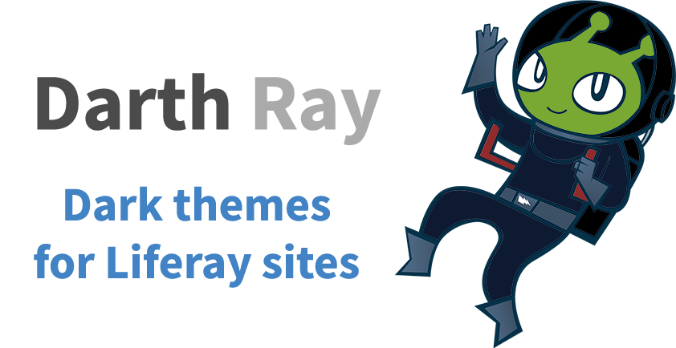
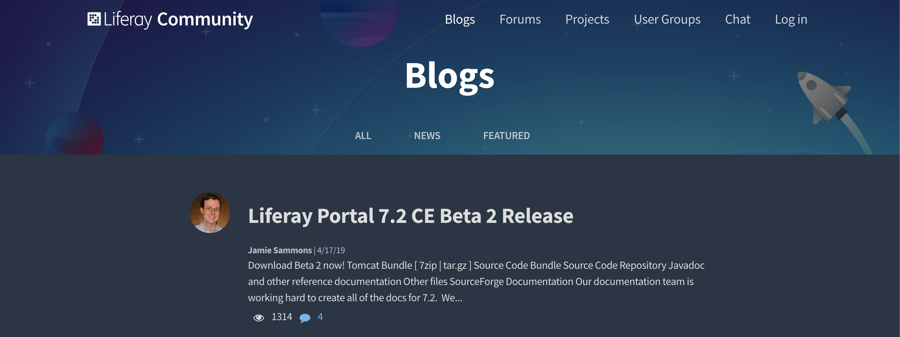
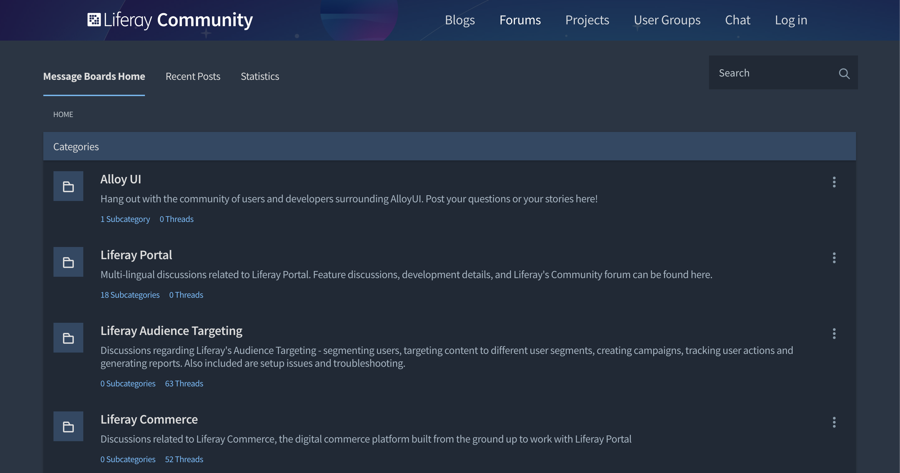
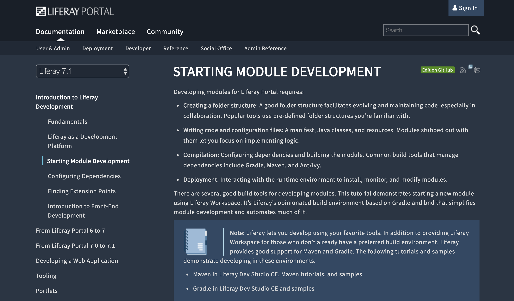

<h3 align="center"><i>Come to the Dark Side and rest your eyes.</i></h3>

## Requirement

Install [Stylus](https://add0n.com/stylus.html) for [Chrome](https://chrome.google.com/webstore/detail/stylus/clngdbkpkpeebahjckkjfobafhncgmne), [Firefox](https://addons.mozilla.org/en-US/firefox/addon/styl-us/) or [Opera](https://addons.opera.com/en/extensions/details/stylus/).

## Blogs

## Forums

## Docs

## License

[MIT](LICENSE)